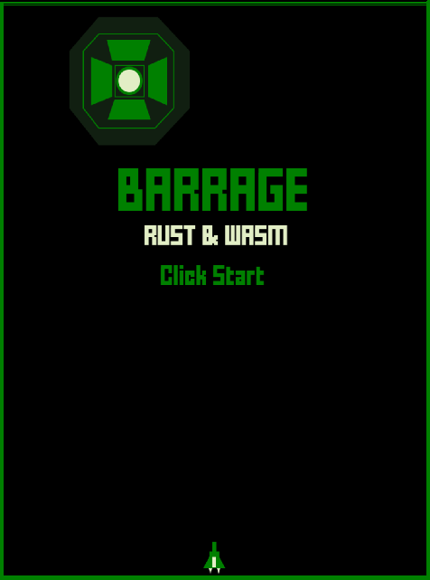

# BARRAGE Rust & Wasm 👾

Programming Shooting retoro mini game in Rust & WebAssembly

[](https://myurioka.github.io/barragerust/)

[Play in browser](https://myurioka.github.io/barragerust)

### How to play (Control)

-   Mouse Operation : Ship Moving
-   Mouse click : Operates & Shooting start / stop
-   Special mode: If you don't shoot for a while

### Requirement

-   Rust, Cargo
-   WASM

### How to Build & Run

```sh
$ cd barragerust
$ pnpm build-wasm
$ pnpm dev --open
```

Browse http://localhost:5173
